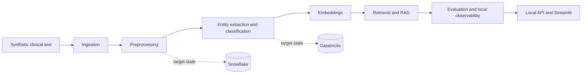

# Healthcare Language AI Platform

Educational foundation for transforming synthetic healthcare text into governed,
searchable, AI-ready datasets.

This repository is a portfolio reference implementation. It is not a medical
device, is not intended for clinical use, is not connected to production
healthcare systems, and uses synthetic data only.

## Business Problem

Healthcare language data is often unstructured, difficult to govern, and hard to
make reproducible for analytics and AI experimentation. Portfolio projects in
this space also need clear safety boundaries so they do not imply clinical
decision-making or use real patient records.

## Proposed Solution

The target platform will demonstrate a local-first, contract-first architecture
for synthetic clinical text, NLP preprocessing, entity extraction,
classification, embeddings, semantic retrieval, RAG evaluation, monitoring, and
portfolio reporting. Milestone 10 adds a local read-only API, Streamlit
portfolio dashboard, operational observability, deterministic demo evidence
over approved synthetic RAG fixtures, Milestone 11 local platform hardening
with contract evolution, runtime resilience, backup/recovery, security,
dependency, container, and portfolio assurance gates, and Milestone 12 final
portfolio packaging with repository audit, architecture evidence, traceability,
reviewer guides, release readiness, and a local release manifest.

## Target Users and Roles

- Data and AI engineers evaluating healthcare NLP architecture patterns.
- Analytics engineers exploring governed text data products.
- Technical recruiters and interviewers reviewing portfolio evidence.
- Learners studying safe synthetic-data engineering practices.

## Architecture Overview

Implemented now: packaging, typed configuration, structured logging, domain
models, CLI foundation, deterministic synthetic clinical-document generation,
ground-truth annotations, manifests, validation reports, local deterministic
ingestion, canonical document and annotation exports, reconciliation,
quarantine-ready evidence, Snowflake-oriented schemas and load planning, tests,
deterministic local preprocessing, controlled text normalisation, section and
sentence outputs, lexical-token statistics, annotation projection,
Databricks-style contracts and dry-run planning, retrieval quality gates,
guarded deterministic RAG, shared application services, local FastAPI,
Streamlit portfolio dashboard, local operational events, deterministic demo
reports, portfolio evidence summary, contract compatibility assurance,
configuration hardening, local resilience controls, operational event integrity,
backup/recovery evidence, local security scanning, dependency inventory, SBOM,
container assurance, documentation, CI, Docker baseline, final repository
audit, architecture pack, capability and technology maps, role alignment,
interview evidence, demonstration guides, evidence index, run registry,
portfolio model card, release-readiness gates, release manifest, and local
reviewer package generation.

Not implemented: production authentication, production authorization, public
hosting, real patient integration, clinical workflow integration, hosted LLMs,
automatic model downloads, cloud monitoring, cloud deployment, live Snowflake,
live Databricks, live MLflow, production vector databases, or clinical
validation.



## Milestone 1 Scope

Milestone 1 created the repository and architecture baseline. Milestone 2 adds
deterministic synthetic clinical-document fixtures with annotations, manifests,
checksums, privacy-pattern checks, and clinical-safety wording checks. NLP
pipelines, models, APIs, dashboards, cloud resources, and external platform
connections remain future work. Milestone 3 adds local ingestion and
Snowflake-oriented contracts without live Snowflake connectivity. Milestone 4
adds local preprocessing and Databricks-style contracts without PySpark or a
live Databricks workspace.

## Technology Roadmap

Python 3.12, Pydantic v2, pydantic-settings, Typer, PyYAML, structlog, pytest,
pytest-cov, Ruff, mypy, Docker, GitHub Actions, and Make are active in this
milestone. AI, NLP, data platform, and dashboard technologies are documented as
future integrations only.

## Repository Structure

```text
src/healthcare_language_ai/   Python package
config/                       Safe local YAML configuration
docs/                         Architecture, governance, development and roadmap
tests/                        Unit and integration tests
infrastructure/               Future platform placeholders
models/                       Future model asset placeholders
pipelines/                    Future pipeline placeholders
data/                         Ignored local data folders with .gitkeep files
outputs/ reports/             Ignored local result folders
```

## Local Setup

```bash
python -m venv .venv
source .venv/bin/activate
python -m pip install --upgrade pip
python -m pip install -r requirements-dev.txt
```

## CLI Usage

```bash
python -m healthcare_language_ai version
python -m healthcare_language_ai config-show --config config/application.yaml
python -m healthcare_language_ai validate-environment
python -m healthcare_language_ai synthetic-generate --count 15 --seed 2026 --document-type all --reference-timestamp 2026-01-01T09:00:00+00:00 --output-dir outputs/synthetic
python -m healthcare_language_ai synthetic-validate --dataset-dir outputs/synthetic
python -m healthcare_language_ai synthetic-summary --dataset-dir outputs/synthetic
python -m healthcare_language_ai ingest-run --source-dir tests/fixtures/synthetic --output-root outputs/ingestion --mode strict --reference-timestamp 2026-01-02T09:00:00+00:00
python -m healthcare_language_ai ingest-validate --ingestion-dir outputs/ingestion/<run-id>
python -m healthcare_language_ai ingest-summary --ingestion-dir outputs/ingestion/<run-id>
python -m healthcare_language_ai snowflake-plan --ingestion-dir outputs/ingestion/<run-id>
python -m healthcare_language_ai preprocess-run --ingestion-dir tests/fixtures/ingestion/ING-92a15c8f10047400ee895203 --output-root outputs/preprocessing --mode conservative --reference-timestamp 2026-01-03T09:00:00+00:00
python -m healthcare_language_ai preprocess-validate --preprocessing-dir outputs/preprocessing/<run-id>
python -m healthcare_language_ai preprocess-summary --preprocessing-dir outputs/preprocessing/<run-id>
python -m healthcare_language_ai databricks-plan --preprocessing-dir outputs/preprocessing/<run-id>
python -m healthcare_language_ai api-validate
python -m healthcare_language_ai api-run --host 127.0.0.1 --port 8000
python -m healthcare_language_ai dashboard-validate
python -m healthcare_language_ai dashboard-run --port 8501 --service-mode direct
python -m healthcare_language_ai demo-run --scenario-set standard --output-dir reports/demo
python -m healthcare_language_ai portfolio-summary --output-dir reports/portfolio
python -m healthcare_language_ai contracts-validate --baseline-dir tests/fixtures/assurance/contracts/baseline
python -m healthcare_language_ai configuration-assurance --output-dir reports/assurance
python -m healthcare_language_ai operational-integrity --events-dir tests/fixtures/observability --output-dir reports/assurance/observability
python -m healthcare_language_ai security-assurance --output-dir reports/assurance
python -m healthcare_language_ai dependency-inventory --output-dir reports/assurance
python -m healthcare_language_ai sbom-generate --output-dir reports/assurance
python -m healthcare_language_ai container-assurance --dockerfile Dockerfile --output-dir reports/assurance
python -m healthcare_language_ai portfolio-assurance --output-dir reports/assurance
python -m healthcare_language_ai portfolio-audit --output-dir reports/portfolio/audit
python -m healthcare_language_ai architecture-pack --output-dir reports/portfolio/architecture
python -m healthcare_language_ai traceability-build --output-dir reports/portfolio/traceability
python -m healthcare_language_ai release-readiness --output-dir reports/release
python -m healthcare_language_ai release-manifest --readiness-dir reports/release --output-dir reports/release
python -m healthcare_language_ai release-package --readiness-dir reports/release --output-root outputs/portfolio-release
python -m healthcare_language_ai portfolio-final-summary
```

Milestone 10 documentation starts at `docs/milestones/milestone-10.md`.
Milestone 11 documentation starts at `docs/milestones/milestone-11.md`.
Milestone 12 documentation starts at `docs/milestones/milestone-12.md`.

After installation, the same commands are available through
`healthcare-language-ai`.

## Testing and Quality Commands

```bash
make quality
make validate
make runtime-smoke
make portfolio-final-summary
make verify-synthetic-fixtures
python -m ruff check .
python -m ruff format --check .
python -m mypy src
python -m pytest
```

## Docker Usage

```bash
docker build -t healthcare-language-ai-platform:milestone-2 .
docker run --rm -v "$(pwd)/outputs:/app/outputs" healthcare-language-ai-platform:milestone-2 healthcare-language-ai synthetic-generate --count 10 --seed 2026 --output-dir /app/outputs/synthetic
docker build -t healthcare-language-ai-platform:milestone-3 .
docker run --rm -v "$(pwd)/tests/fixtures:/app/fixtures:ro" -v "$(pwd)/outputs:/app/outputs" healthcare-language-ai-platform:milestone-3 healthcare-language-ai ingest-run --source-dir /app/fixtures/synthetic --output-root /app/outputs/ingestion --mode strict --reference-timestamp 2026-01-02T09:00:00+00:00
docker build -t healthcare-language-ai-platform:milestone-4 .
docker run --rm -v "$(pwd)/tests/fixtures:/app/fixtures:ro" -v "$(pwd)/outputs:/app/outputs" healthcare-language-ai-platform:milestone-4 healthcare-language-ai preprocess-run --ingestion-dir /app/fixtures/ingestion/ING-92a15c8f10047400ee895203 --output-root /app/outputs/preprocessing --mode conservative --reference-timestamp 2026-01-03T09:00:00+00:00
docker build -t healthcare-language-ai-platform:milestone-5 .
docker run --rm -v "$(pwd)/tests/fixtures:/app/fixtures:ro" -v "$(pwd)/outputs:/app/outputs" healthcare-language-ai-platform:milestone-5 healthcare-language-ai extract-run --preprocessing-dir /app/fixtures/preprocessing/PRE-72e9829c61769cea948faacc --output-root /app/outputs/extraction --text-representation normalised_text --reference-timestamp 2026-01-04T09:00:00+00:00
docker build -t healthcare-language-ai-platform:milestone-6 .
docker run --rm -v "$(pwd)/tests/fixtures:/app/fixtures:ro" -v "$(pwd)/outputs:/app/outputs" healthcare-language-ai-platform:milestone-6 healthcare-language-ai index-build --preprocessing-dir /app/fixtures/preprocessing/PRE-72e9829c61769cea948faacc --extraction-dir /app/fixtures/extraction/EXT-723871c87dfd1f3a3bb89b8d --output-root /app/outputs/retrieval/indexes --unit-type all --embedding-provider deterministic_hash --reference-timestamp 2026-01-06T09:00:00+00:00
docker build -t healthcare-language-ai-platform:milestone-7 .
docker run --rm -v "$(pwd)/tests/fixtures:/app/fixtures:ro" healthcare-language-ai-platform:milestone-7 healthcare-language-ai retrieval-compare-validate --comparison-dir /app/fixtures/retrieval-quality/comparison/RETCOMP-11dee1c6ea11ed7908dff7ce
docker build -t healthcare-language-ai-platform:milestone-8 .
docker run --rm -v "$(pwd)/tests/fixtures:/app/fixtures:ro" healthcare-language-ai-platform:milestone-8 healthcare-language-ai retrieval-remediation-compare-validate --comparison-dir /app/fixtures/retrieval-remediation/comparison/REMCOMP-1a3a8c86fc4567de3049f352
docker build -t healthcare-language-ai-platform:milestone-9 .
docker run --rm -v "$(pwd)/tests/fixtures:/app/fixtures:ro" healthcare-language-ai-platform:milestone-9 healthcare-language-ai rag-approval --evaluation-dir /app/fixtures/rag/evaluation/RAGEVAL-d8d3b3b6892133372f91d017
docker build -t healthcare-language-ai-platform:milestone-11 .
docker run --rm -v "$(pwd)/reports:/app/reports" healthcare-language-ai-platform:milestone-11 healthcare-language-ai portfolio-assurance --output-dir /app/reports/assurance
docker build -t healthcare-language-ai-platform:milestone-12 .
docker run --rm healthcare-language-ai-platform:milestone-12 healthcare-language-ai portfolio-final-summary
```

The image defaults to a local validation command. Runtime API and dashboard
smoke tests are explicit and are not part of default validation.

## Security and Privacy Principles

- Synthetic data only.
- No real patient records or direct identifiers.
- No diagnosis, treatment, medication, or patient-specific medical advice.
- Safe logging that avoids full clinical text and secrets.
- Local-first validation with no cloud credentials.

## Milestone Roadmap

See [docs/milestone-roadmap.md](docs/milestone-roadmap.md).

## Milestone 7 Retrieval Quality

Implemented: independent synthetic retrieval holdout, expanded query benchmark,
query expansion, negation-aware retrieval features, numeric-aware retrieval
features, abbreviation handling, section aliases, cross-granularity retrieval
policies, two-stage candidate generation and reranking, deterministic
configuration comparison, retrieval quality gates, approved-baseline decision
workflow, and an optional offline local sentence-transformer inspection path.

Not implemented: RAG, LLM answer generation, prompt orchestration, hosted
embedding APIs, automatic model download, production vector database, live
Databricks Vector Search, clinical search deployment, clinician-validated
relevance judgments, API, user interface, or cloud deployment.

## Milestone 8 Retrieval Remediation

Implemented: failure inventory for the Milestone 7 selected baseline, judgment
audit/adjudication evidence, non-mutating benchmark v2.1, remediation
configuration registry, character n-gram retrieval, phrase and proximity
features, synonym expansion, pseudo-relevance feedback, field/entity-aware
retrieval features, ensembles, feature reranking, diversification, retrieval
confidence, abstention, comparison gates, and MLflow/Databricks/Vector Search
dry-run contracts. The selected `abstaining_ensemble_v1` baseline is approved
only for future synthetic RAG prototype work.

Not implemented: RAG, answer generation, prompt orchestration, hosted embedding
APIs, automatic model download, live vector search, clinical deployment,
clinician-reviewed judgments, API, user interface, or cloud deployment.

## Milestone 9 Guarded Synthetic RAG

Implemented: guarded synthetic RAG orchestration, approved retrieval-baseline
validation, query safety classification, retrieval-abstention propagation,
bounded evidence assembly, versioned prompt contracts, deterministic evidence
generator, citation-bearing answers, citation validation, claim extraction,
groundedness validation, conflict detection, safety validation, refusal
behaviour, RAG evaluation, quality gates, local-demo approval decision, and
MLflow/Databricks dry-run plans.

Optional but not required: explicitly supplied offline local generator adapter.

Not implemented: hosted LLMs, automatic model downloads, clinical diagnosis,
treatment advice, medication advice, patient-specific guidance, production API,
user interface, live Databricks, live MLflow, live Snowflake, cloud deployment,
or clinical validation.

## Current Limitations

The repository has deterministic synthetic data generation, local ingestion,
local preprocessing, rule-based entity extraction, rule-based document
classification, exact-span evaluation, per-label metrics, confusion matrices,
error analysis, a baseline model card, local retrieval corpus construction,
keyword/TF-IDF/BM25/hybrid retrieval, deterministic hash-vector embeddings,
metadata filtering, retrieval evaluation, retrieval cards, and
MLflow/Databricks dry-run contracts. Milestone 9 adds guarded synthetic RAG
orchestration with deterministic generation and citation validation for local
portfolio demonstration only. It has no hosted embeddings, automatic model
downloads, production vector database, live MLflow, live Databricks Vector
Search, API, dashboard, cloud deployment, Fabric, or Power BI.
