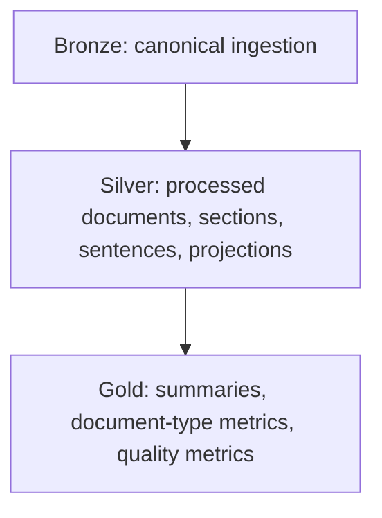

# Databricks Target State

Databricks is represented only through dry-run contracts.

No workspace, cluster, job, Unity Catalog object, Delta table, or Spark runtime
is created. The plan records target medallion layers, notebook sequence, table
contracts, job dependencies, quality gates, and expected counts.
## Milestone 5 Target-State Extension

The target-state design now includes logical Milestone 5 tables:
`silver_entity_predictions`, `silver_document_classifications`,
`gold_entity_evaluation_metrics`, `gold_document_classification_metrics`,
`gold_error_analysis`, and `gold_baseline_model_registry`.

Reference-only downstream tasks are `08_run_rule_based_extraction`,
`09_classify_documents`, `10_evaluate_baseline`, and
`11_publish_metrics_and_model_card`. These are contracts only; no Databricks
connection or PySpark execution is implemented.

## Milestone 6 Vector Search Target State

Logical target tables now include `silver_retrieval_units`,
`silver_sparse_features`, `silver_dense_embeddings`, `silver_retrieval_queries`,
`gold_retrieval_results`, `gold_retrieval_metrics`, `gold_retrieval_failures`,
and `gold_retrieval_index_registry`. Workflow steps `12` through `17` are
reference-only and no endpoint is created.

## Milestone 9 RAG Target State

Milestone 9 adds RAG target-state logical tables and workflows for evidence
bundles, answers, claims, citations, evaluation metrics and approval registry.
No Databricks endpoint, job or cluster is created.
