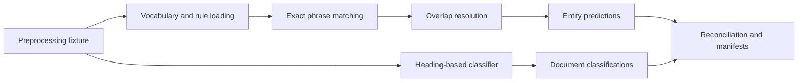

# Entity Extraction Architecture

Milestone 5 consumes validated preprocessing evidence only. The local flow is:

Inputs are `processed_documents`, `processed_sections`, `processed_sentences`, and
`projected_annotations`. Outputs preserve lineage to preprocessing and contain no
full-text summaries or logs.

