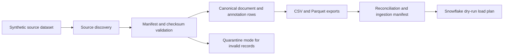

# Ingestion Architecture

Milestone 3 ingests validated Milestone 2 synthetic datasets into local
canonical rows and Snowflake-oriented evidence. It remains fully local.

Strict mode fails on mandatory validation errors. Quarantine mode can promote
valid records while recording rejected items with sanitized error evidence.

Run IDs are deterministic and derive from source manifest checksum, contract
version, mode, reference timestamp, and output settings. Persisted evidence uses
the configured reference timestamp, not wall-clock time.

Symlink policy is explicit: source files are rejected by default when they are
symlinks. Recursive directory ingestion is not supported.
