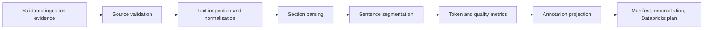

# Preprocessing Architecture

Milestone 4 consumes validated ingestion evidence and writes deterministic local
preprocessing outputs.

The pipeline preserves source text exactly and writes derived `normalised_text`
and optional `analytical_text` fields. Persisted timestamps use the configured
reference timestamp, not wall-clock time.
