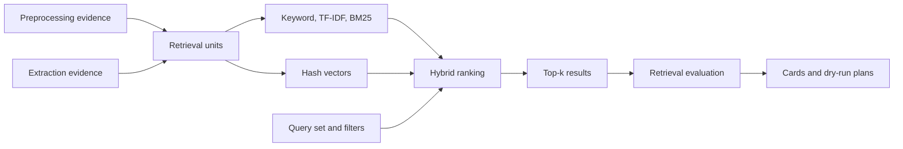

# Retrieval Architecture

Milestone 6 builds a fully local retrieval workflow over validated synthetic
preprocessing and extraction evidence.

The system returns evidence passages only. It does not generate answers.
## Milestone 7 Extension

Milestone 7 extends retrieval with query expansion, negation and numeric compatibility features, cross-granularity policies, candidate reranking, and deterministic comparison across a finite configuration registry. These features produce retrieval evidence only; they do not assemble prompts or answers.

## Milestone 9 RAG Consumption

Milestone 9 consumes the approved Milestone 8 retrieval baseline and propagates
retrieval abstention into guarded RAG refusals. Retrieval still owns evidence
selection; RAG does not silently substitute another retriever.
