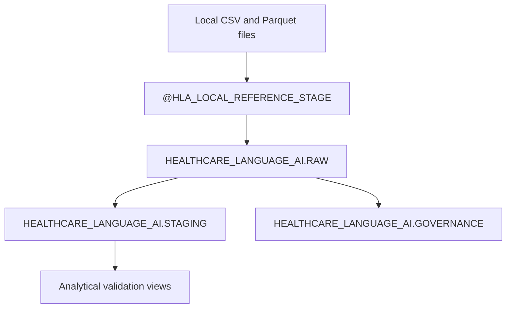

# Snowflake Target State

Snowflake is represented only through target-state contracts and reference SQL.
No connection is attempted.

Reference SQL covers database and schemas, CSV and Parquet file formats, raw
tables, staging tables, governance tables, basic views, validation queries, and
least-privilege roles. Scripts are not executed by this repository.

The load plan uses abstract stage `@HLA_LOCAL_REFERENCE_STAGE`, expected row
counts, checksums, column mappings, reference `COPY INTO` statements, and
post-load validation queries.
